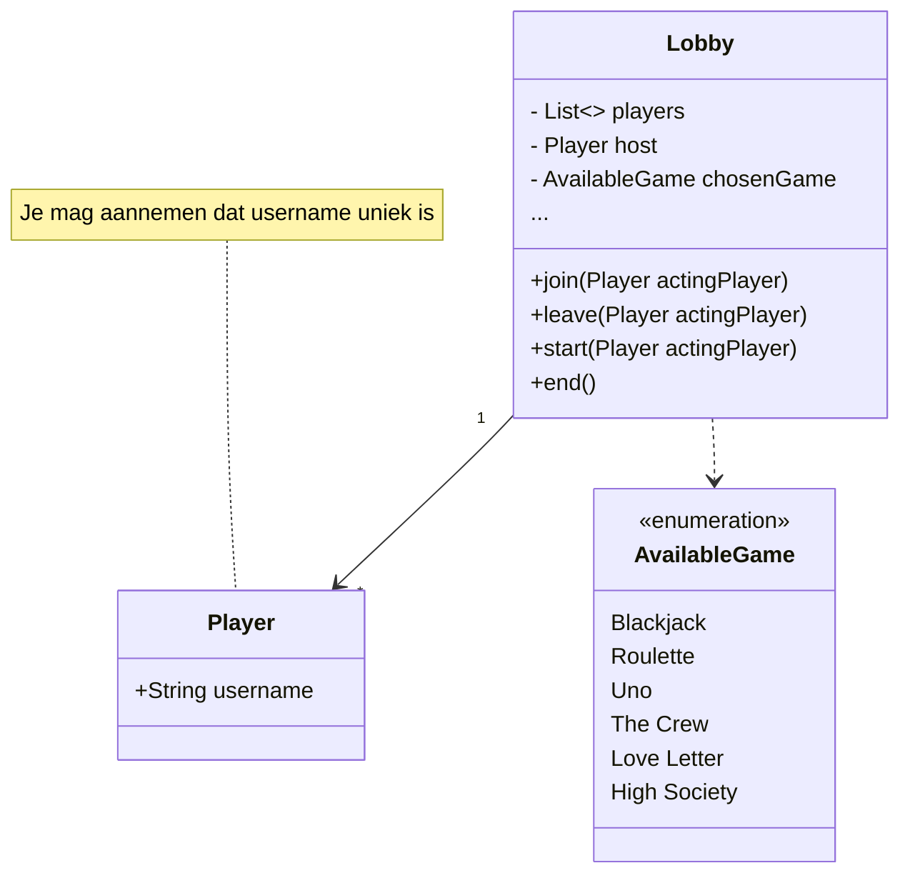

# pages-klooien

Emoji!

:blush:

Ik ben een zeemeermin:

En ik ben een boerenpummel:


@startuml
 class Example {
    - String name
    - int number 
    
    +void getName()
    +void getNumber()
    +String toString()
  }
@enduml


PlantUML is kennelijk ook nukkig, want dit is **iets anders**??


@startuml
testdot
@enduml


En is testdot eigenlijk wel goed genoeg?


@startuml
left to right direction

cloud "Azure" {

    node "Some Virtual Machine" {    
        frame "MyApplication.jar" {            
            rectangle "Vite Frontend" as fe             
            rectangle "Backend" as be
        }
        database "Postgres" as pg
        
        ' Dit is echt fucking zwarte chatgpt magie
        fe -[hidden]down-> be
        be -[hidden]down-> pg

        be -> pg
        fe -> be
        
    }
}

@enduml
