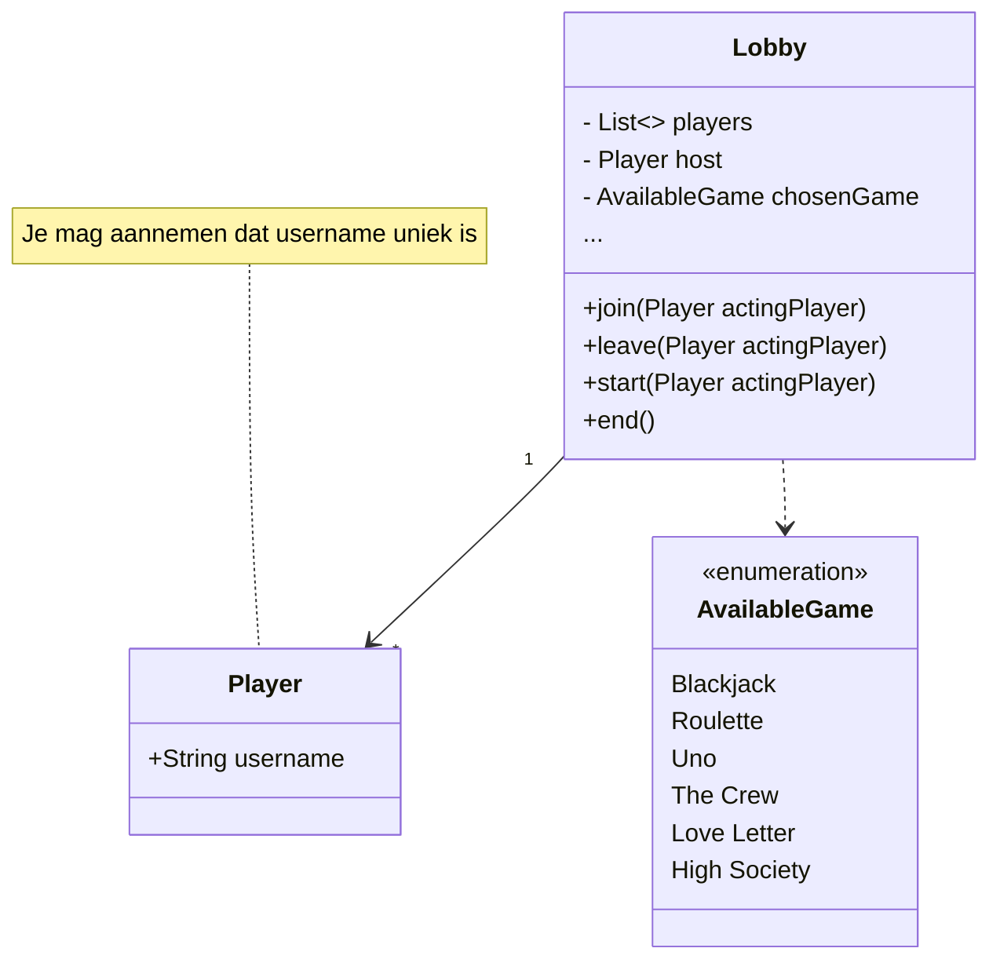

# pages-klooien

Emoji!

:blush:

Ik ben een zeemeermin:

En ik ben een boerenpummel:


@startuml
 class Example {
    - String name
    - int number 
    
    +void getName()
    +void getNumber()
    +String toString()
  }
@enduml


PlantUML is kennelijk ook nukkig, want dit is **iets anders**??


@startuml
testdot
@enduml
